# Devlog — ตุ๊กตุ๊กรอบสุดท้าย (Last Ride Home)

เกมผจญภัยเล่าเรื่อง pixel art 8-bit มุมมองด้านข้าง สำหรับโครงการ **NEXT-SHAPE "ปั้นโลก" (Thai Next Thainess)**
ผู้เล่นรับบท **ลุงแอด** คนขับตุ๊กตุ๊กกลางคืน ที่ขับส่งวิญญาณผู้โดยสารไปวัดบนเนินให้ทันก่อนฟ้าสาง

> Unity 6000.3.12f1 · URP · Input System · PC (Windows)

---

## Devlog #1 — 9 ตุลาคม 2569 · จากไอเดียสู่ prototype ที่เล่นได้ในวันเดียว

### สรุปสั้น ๆ

วันนี้เปลี่ยนจากแค่ Concept Paper ให้กลายเป็น **prototype ที่เล่นได้ตั้งแต่ต้นถึงจบเที่ยว** ใน Unity ครบวงจร: ขับ → เจอจุด (!) → จอด → กด Space → คัทซีนสนทนา → เลือกรับ/ไม่รับ → แวะศาล/ปั๊ม/ร้านชำ → ส่งผู้โดยสารที่วัด → ตอนจบ

ภาพทั้งหมดในเกมเป็น pixel art ที่ **วาดด้วยโค้ด** (ไม่มีไฟล์ภาพต้นฉบับจากภายนอก) เสียงทั้งหมดสังเคราะห์ด้วยโค้ดเช่นกัน

### ภาพจาก prototype

| | |
|---|---|
| 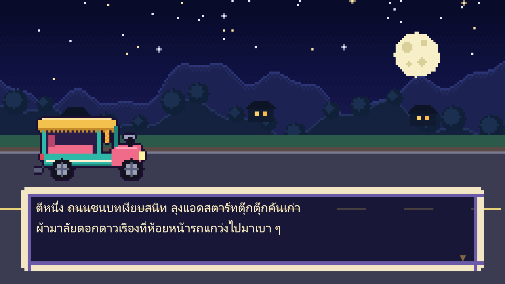 | 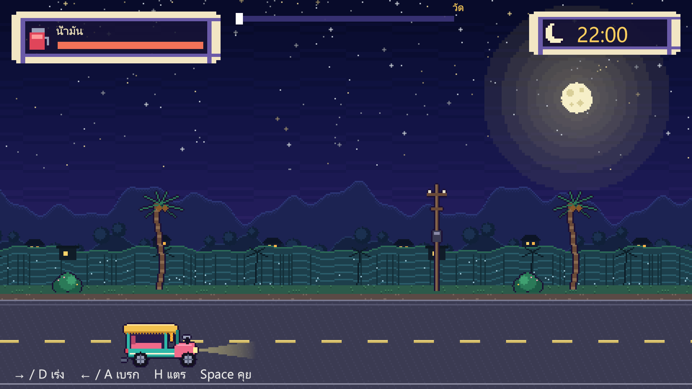 |
| **ฉากเปิดเรื่อง** — คัทซีนตัดเข้าเมื่อเริ่มเที่ยว | **ขับกลางคืน** — ถนนเลนเดียว, HUD น้ำมัน/นาฬิกา/ระยะทางถึงวัด |
| 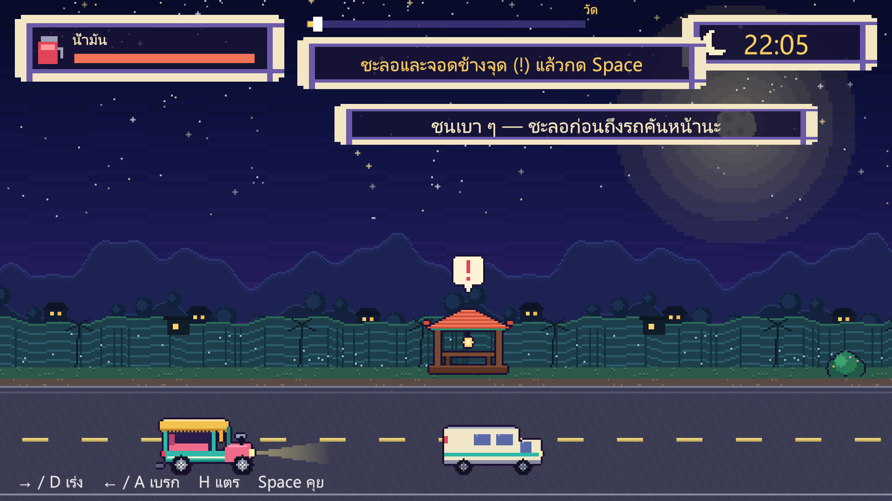 | 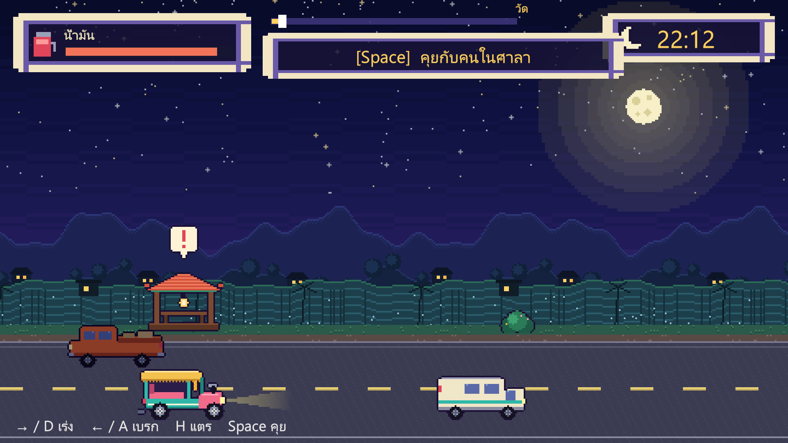 |
| **รถนำหน้า** — วิ่งแบบจอดๆ เดินๆ ต้องคุมระยะเอง | **จุด (!)** — ชะลอและจอดข้างจุดแล้วกด Space |
| 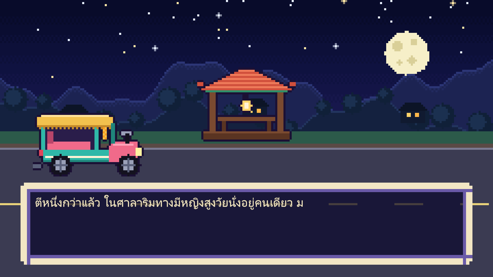 | 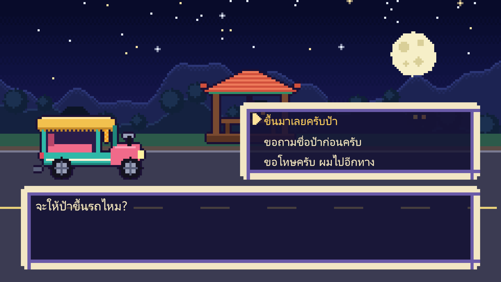 |
| **คัทซีนสนทนา** — ข้อความพิมพ์ทีละตัว | **ตัวเลือก** — รับขึ้นรถ / ถามก่อน / ไม่รับ |
| 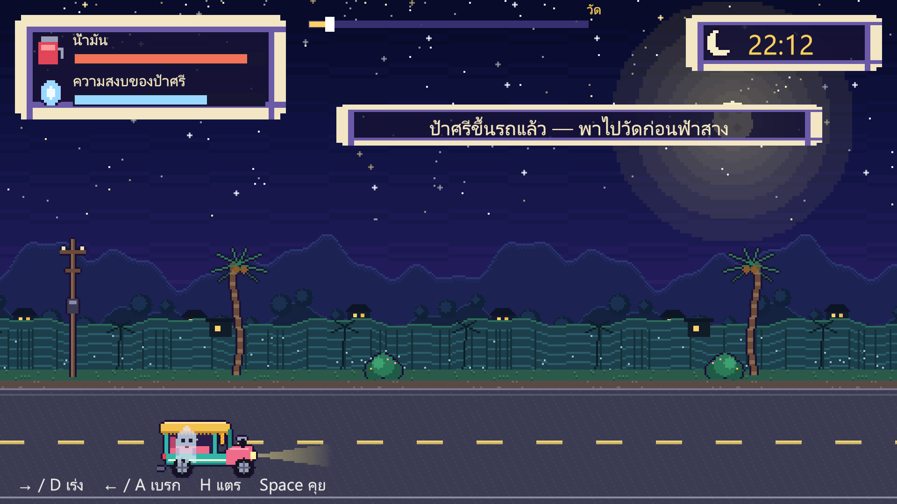 | 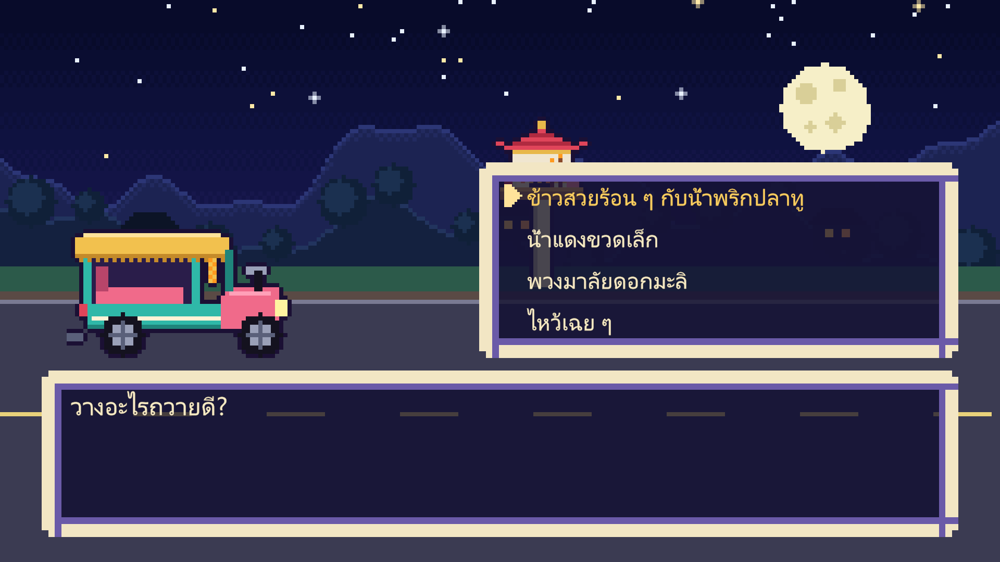 |
| **ผู้โดยสารผีนั่งหลังรถ** — มีแถบความสงบ | **ศาลพระภูมิ** — เลือกของเซ่นให้ถูกใจผู้โดยสาร |
| 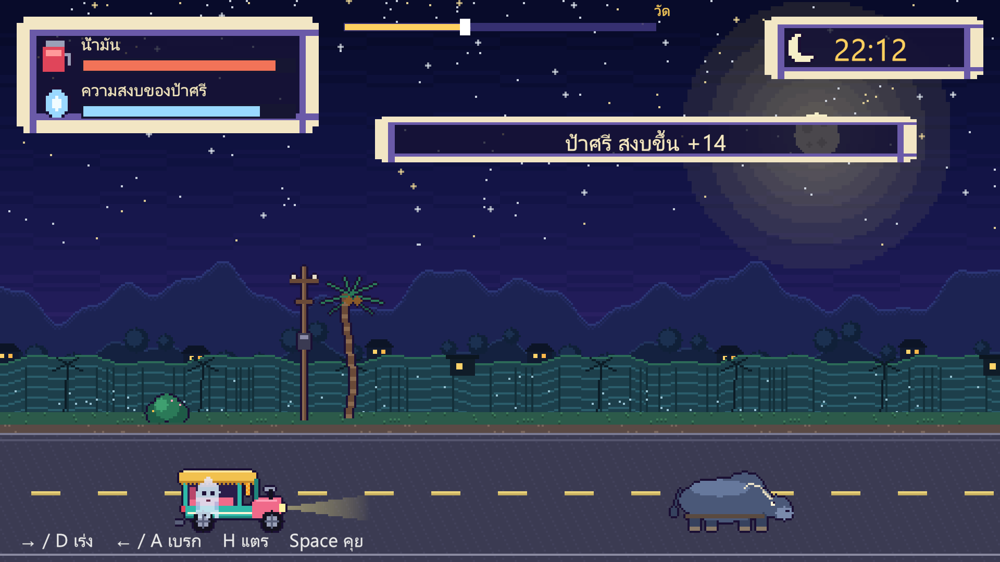 | 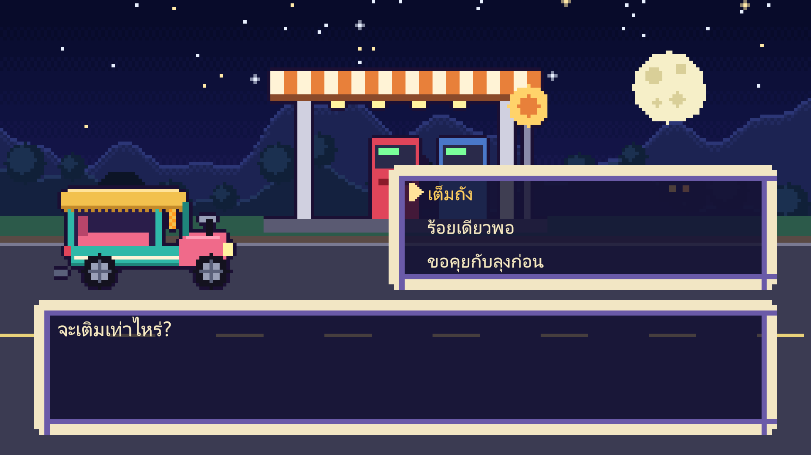 |
| **ควายขวางถนน** — จอดรอให้เดินหลบ หรือบีบแตรเร่ง | **ปั๊มน้ำมัน** — ท้องฟ้าเริ่มเป็นสีรุ่งเช้า |
| 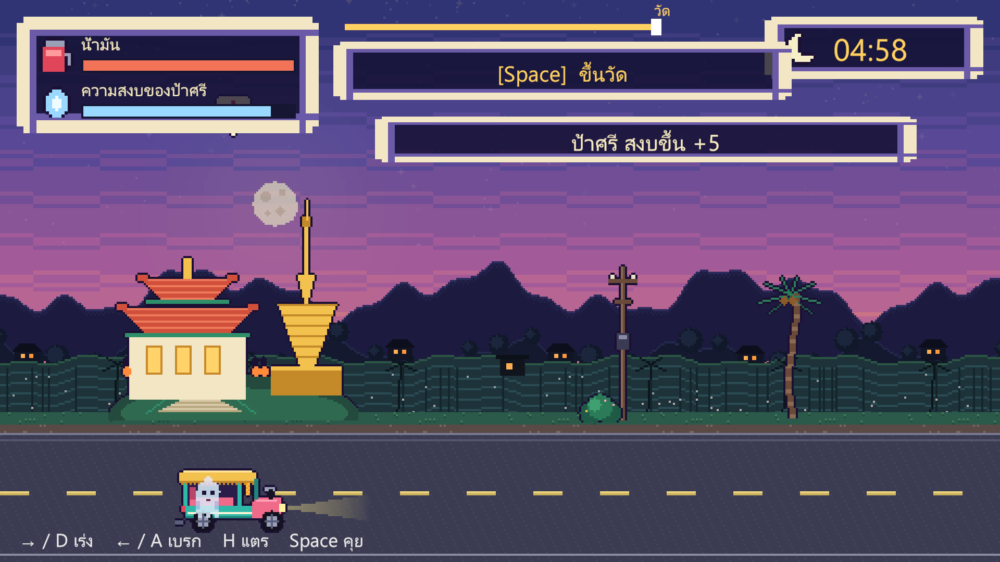 | 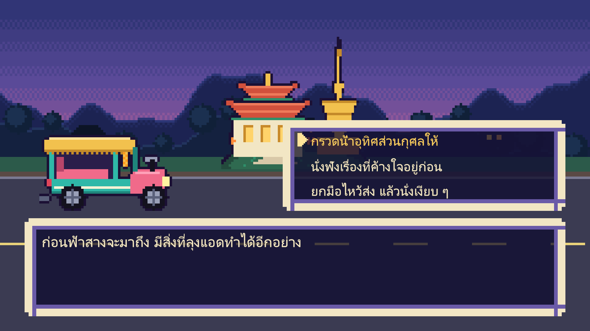 |
| **ถึงวัดบนเนิน** | **พิธีส่งวิญญาณ** — เลือกกรวดน้ำ / ฟัง / ไหว้เงียบ ๆ |
| 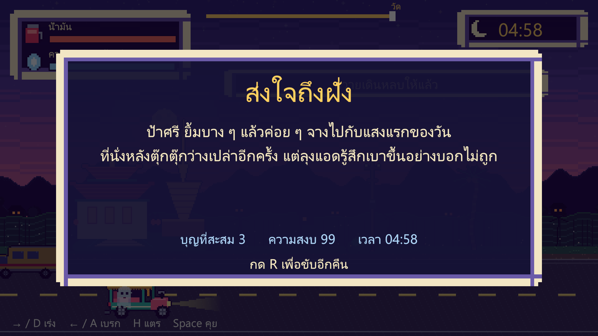 | |
| **ตอนจบ** — สรุปบุญ ความสงบ เวลา กด R เล่นใหม่ | |

> ภาพถ่ายจากการรัน session จำลองอัตโนมัติ (ชุดนี้ถ่ายหลังแก้วรรณยุกต์แล้ว) (`ShotBot`) ไม่ใช่การเล่นด้วยมือ — ดูหัวข้อ "สิ่งที่ยังไม่ได้ตรวจ" ด้านล่าง

### สิ่งที่ทำเสร็จวันนี้

**โลกและการขับ**
- ฉาก side-scroll เลนเดียว: ท้องฟ้ากลางคืนไล่สี (dithering แบบ 8-bit) ดาวกะพริบ พระจันทร์ ภูเขา เนินเขา นาข้าว ถนน เสาไฟ มะพร้าว พุ่มไม้ ร้านชำริมทาง เลื่อนเป็นชั้น (parallax)
- ตุ๊กตุ๊กอยู่ตำแหน่งเดิมบนจอ โลกเลื่อนผ่าน ล้อหมุน 2 เฟรม ไฟหน้า มีผู้โดยสารผีนั่งเบาะหลัง
- ควบคุม: **→/D เร่ง · ←/A เบรก · H แตร · Space คุย** (รองรับ gamepad)
- **รถนำหน้า** วิ่งแบบสุ่ม ช้า–เร็ว–หยุด ไฟเบรกติด ต้องตามจังหวะ + รถสวนเลนตรงข้ามเป็นบรรยากาศ
- ชนไม่มี game over — ผู้โดยสารแค่ตกใจ (ความสงบลดเล็กน้อย)
- **ควาย** ขวางถนน: จอดรอ ~3 วินาที หรือบีบแตรให้เร็วขึ้น แล้วมันจะเดินหลบ
- น้ำมันลดตามระยะทาง เติมที่ปั๊มเท่านั้น (หมดแล้วยังเข็นไปได้ช้า ๆ)

**จุดอีเวนต์ (กด Space)** — ตามเส้นทางยาว 1,300 หน่วย
1. ศาลาริมทาง → **ป้าศรี** แม่ค้าข้าวแกง (รับ / ถามก่อน / ไม่รับ)
2. ศาลพระภูมิ → เลือกของเซ่น (ข้าว / น้ำแดง / พวงมาลัย / ไหว้เฉย ๆ) ผู้โดยสารแต่ละคนชอบต่างกัน
3. ต้นไทรริมโค้ง → **พี่ต้น** คนขับรถบรรทุก (ถ้ามีผู้โดยสารแล้วจะไม่ขึ้น)
4. ควายขวางถนน
5. ปั๊มน้ำมัน → เติมเต็ม / เติมบางส่วน / คุยกับลุงเจ้าของปั๊ม
6. ร้านชำ → รับน้ำเก๊กฮวย
7. วัดบนเนิน → พิธีส่งวิญญาณ → ตอนจบ

**ระบบ**
- **นาฬิกาก่อนฟ้าสาง** 22:00 → 05:30: เดินตอนขับ ช้าลงเมื่อจอด หยุดในคัทซีน ท้องฟ้าไล่จากกลางคืนเป็นรุ่งเช้า ดาวหาย พระจันทร์ตก
- **ความสงบ** ของผู้โดยสาร (ขึ้นลงตามบทสนทนา ของเซ่น ปั๊ม ร้านน้ำ ฯลฯ) · **บุญ** สะสมจากการทำดี
- **ตอนจบ 4 แบบ**: ส่งใจถึงฝั่ง (ความสงบ ≥ 55) · ยังมีเรื่องค้างใจ · คืนที่เงียบ (ไม่รับใคร) · ฟ้าสางเสียก่อน (หมดเวลา)
- เสียงสังเคราะห์: เครื่องยนต์ แตร เสียงพิมพ์ข้อความ เพลงวนสเกลเพนทาโทนิก

**UI**
- คัทซีนพิกเซล: ฉากหลัง ภาพคนคุย (ลุงแอด ป้าศรี พี่ต้น ลุงปั๊ม ป้าร้านชำ) กรอบข้อความ ตัวเลือกเลื่อนด้วย ↑/↓
- ข้อความไทยใช้ TextMeshPro เพื่อให้สระ/วรรณยุกต์ซ้อนถูกต้อง

### ภาพประกอบคัทซีนจาก Higgsfield (อัปเดตท้ายวัน)

เปลี่ยนฉากหลังคัทซีน 7 ฉากและภาพคนคุย 5 คน จากภาพวาดด้วยโค้ดเป็นภาพ pixel art ที่เจนด้วย **Higgsfield (gpt_image_2_5, quality high)** ภาพวาดด้วยโค้ดเดิมยังอยู่เป็นตัวสำรอง (ถ้าไม่มีไฟล์ใน `Resources/LastRide/AI` เกมจะใช้ของเดิมเอง)

| | |
|---|---|
| 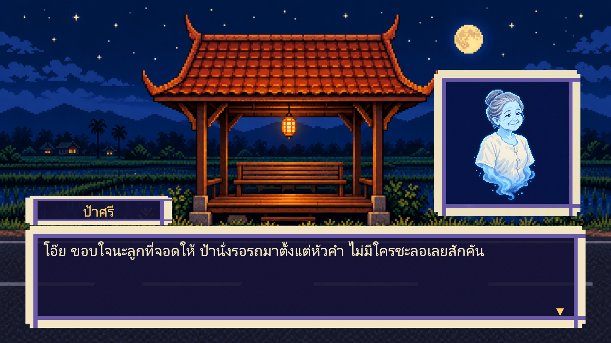 | 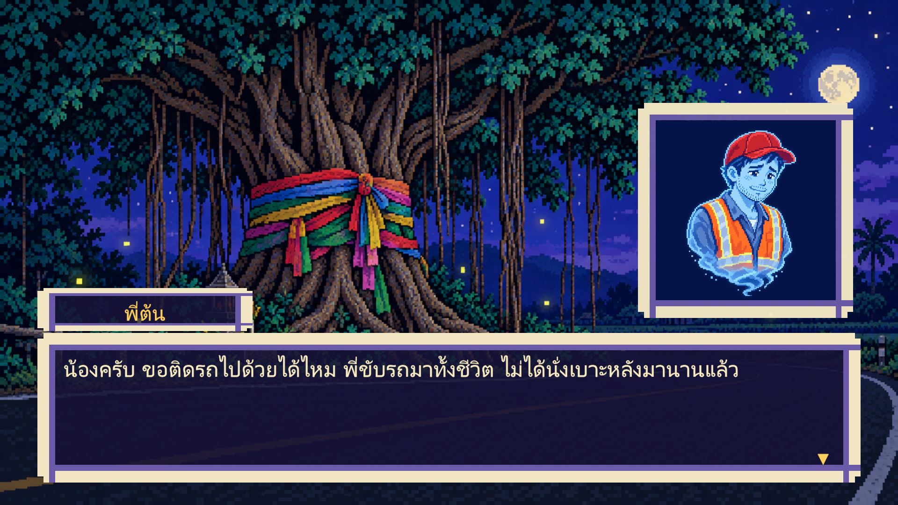 |
| **ศาลา + ป้าศรี** | **ต้นไทร + พี่ต้น** |
| 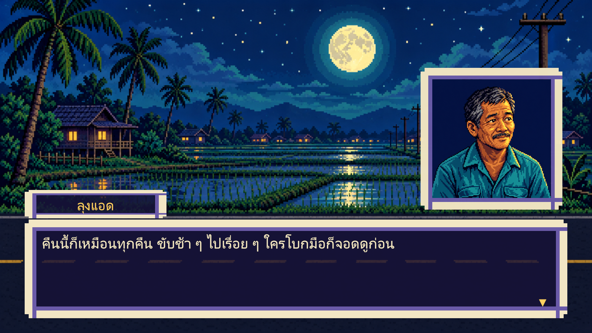 | 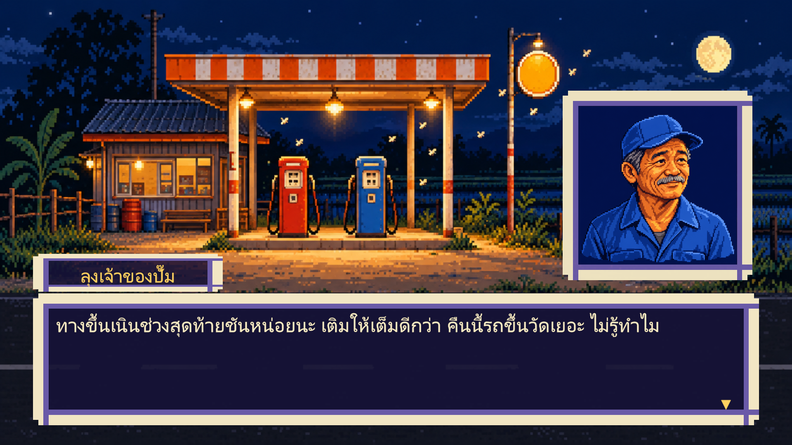 |
| **ถนนชนบท + ลุงแอด** | **ปั๊ม + ลุงเจ้าของปั๊ม** |
| 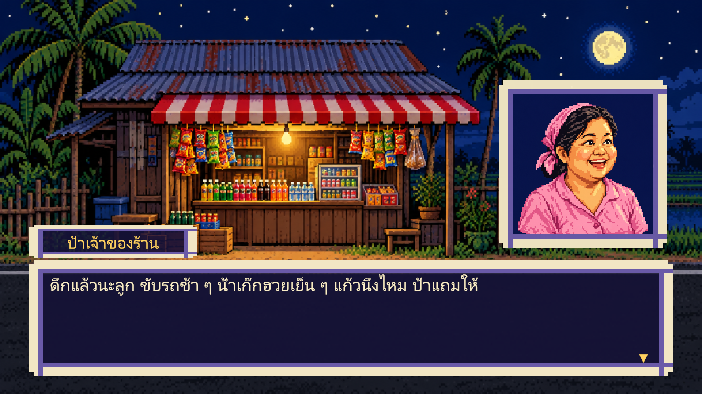 | 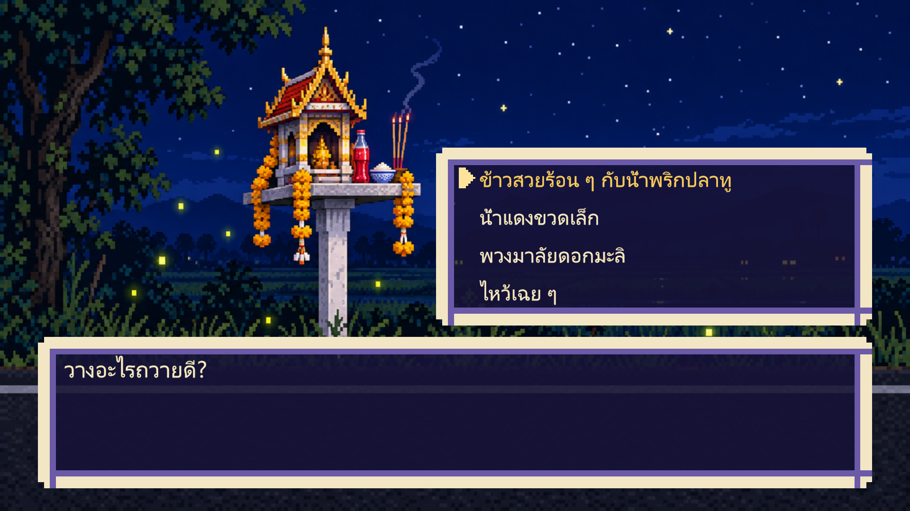 |
| **ร้านชำ + ป้าเจ้าของร้าน** | **ศาลพระภูมิ + ตัวเลือกของเซ่น** |

- ภาพชุดนี้เรนเดอร์จาก UI ของเกมจริง (`DialogueUI`) ในโหมดแก้ไข ไม่ใช่การเล่นเต็มเที่ยว
- ภาพอ้างอิงอารมณ์ (mood board) ที่เจนไว้ก่อนหน้า 5 ภาพอยู่ใน [Docs/MoodBoard/](MoodBoard/)
- ภาพ AI เป็นภาพเต็มสี ไม่ใช่ sprite กริด 16 px จึงนำเข้าด้วย filter แบบ Bilinear (ตั้งค่าอัตโนมัติโดย `LastRideAIImport`) และใช้เฉพาะในคัทซีน ส่วนฉากขับยังเป็น pixel art จากโค้ด
- โครงภาพ: ส่วนสำคัญอยู่ครึ่งบนของภาพ ส่วนล่างเป็นถนนเรียบ เพื่อให้กล่องข้อความไม่บังฉาก

### การตัดสินใจเชิงดีไซน์

| เรื่อง | เลือก | เหตุผล |
|---|---|---|
| โทนเกม | cozy ไม่มี game over | ผีเป็นคนที่มีเรื่องค้างใจ ไม่ใช่ตัวร้าย ความผิดพลาดมีผลแค่ความสงบ |
| สิ่งกีดขวาง | ขับตามรถ/สภาพถนน ไม่ใช่หลบ | มุมมองด้านข้างไม่มีเลน จึงใช้ความเร็วและการจอดเป็นกลไกแทน |
| การจอด | ต้องจอดข้างจุด (!) ถึงกด Space ได้ | ทำให้การขับมีความหมายและเป็นจังหวะเหมือนขับจริง |
| นาฬิกา | เดินช้า ไม่เร่ง | ให้ความกดดันเบา ๆ มีเวลาเผื่อประมาณ 20–30% |
| ผู้โดยสาร | 1 คนต่อ 1 เที่ยว | ทำให้ทางเลือก "รับหรือไม่รับ" มีน้ำหนัก และเล่นซ้ำได้ |

### เทคนิคที่ใช้

- **ไม่มีไฟล์ภาพต้นฉบับ** — `LastRideArt.cs` วาด sprite ทุกตัวด้วยโค้ด (กริด 480×270, 16 px = 1 หน่วย) แล้วเขียนเป็น PNG เมนู `Tools/Last Ride/Build Scene` สร้างใหม่ได้ทุกเมื่อ
- **โลกถูกประกอบตอนรัน** — `RideBootstrap` สร้างทุกอย่างจาก sprite ใน `Resources/` ฉากใน Unity มีแค่กล้องกับสคริปต์เดียว (แก้ง่าย ไม่ชนกันเวลา merge)
- **ระบบโลก** — ตุ๊กตุ๊กไม่ขยับบนจอ ทุกอย่างวางที่ `TukScreenX + worldX − distance` และ snap ตามพิกเซล
- **บทสนทนา** — `Story.cs` เก็บเป็น node + choice + action ใน C# แก้ข้อความได้ที่ไฟล์เดียว
- **ทดสอบอัตโนมัติ** — `ShotBot` เล่นเที่ยวจำลองและถ่ายภาพ ทำให้เห็นหน้าจอจริงโดยไม่ต้องกดเอง

### ปัญหาที่เจอและวิธีแก้

- **ฟอนต์ไทย** — ฟอนต์ OS ที่สร้างผ่าน `CreateDynamicFontFromOSFont` ใช้กับ TMP ไม่ได้ ต้องโหลดไฟล์ฟอนต์ตรง ๆ (`LeelawUI.ttf` / `tahoma.ttf`)
- **TMP essentials** — ต้องนำเข้าครั้งแรกแบบ async จึงเขียนให้ builder รอแล้วค่อยทำต่ออัตโนมัติ
- **คัทซีนโดนกล่องข้อความบัง** — ย้ายเส้นขอบฟ้าและตุ๊กตุ๊กในฉากคัทซีนขึ้นด้านบน
- **วรรณยุกต์หายบนสระบน** ("หนึ่ง" ขึ้นเป็น "หนึง", "ที่" เป็น "ที") — TextMesh Pro ไม่ทำ OpenType substitution ฟอนต์ Windows ทุกตัวที่ลอง (Leelawadee UI, Tahoma, Angsana, Cordia ฯลฯ) วางวรรณยุกต์ทับบนสระพอดี เพิ่ม `ThaiText.Fix()` ยกวรรณยุกต์ที่ตามหลัง ั ิ ี ึ ื ขึ้น 0.16em ด้วย `<voffset>` ทุกข้อความที่ผ่าน TMP แล้วตรวจจากภาพจริง — ถ้าเปลี่ยนไปใช้ฟอนต์อื่นให้ปรับ `ThaiText.Lift` หรือปิดด้วย `ThaiText.ToneFix`
- **ควาย** — เจอ NullReference ตอนเดินหลบ (หา SpriteRenderer ก่อนสร้างลูก) แก้เป็นหาแบบ lazy
- **เทสต์ headless** — Unity ใน batch mode ไม่เรียก `WaitForEndOfFrame` และคอมไพล์ซ้ำกลางเซสชัน ต้องปรับสคริปต์ทดสอบให้ไม่พึ่งสองอย่างนี้

### สิ่งที่ยังไม่ได้ตรวจ / ข้อจำกัด

- ยังไม่มีใครเล่นด้วยมือจริง ภาพทั้งหมดมาจาก session จำลอง — ความรู้สึกการขับ ความสมดุลเวลา/น้ำมัน และเสียง ยังไม่ได้ลองหู
- ยังไม่ได้ทดสอบ gamepad
- เส้นทาง **พี่ต้น** ยังไม่ได้เล่นผ่านครบ (เขียนบทแล้ว แต่สคริปต์ทดสอบเดินเส้นป้าศรี)
- **ฟอนต์ไทยตอนนี้ใช้ฟอนต์ระบบ Windows** — ก่อนส่งงานหรือแจกจ่ายต้องใส่ฟอนต์ไทยที่แจกต่อได้ (เช่น Sarabun, OFL) ใน `Assets/LastRide/Fonts` แล้วรัน Build Scene
- ภาพฉากขับ (ตุ๊กตุ๊ก ถนน ตัวประกอบ) เป็น placeholder เชิงโค้ด ภาพคัทซีนเป็นภาพ AI ควรให้ศิลปินวาดทับหรือปรับแต่งสำหรับรอบ Final เพื่อให้สไตล์เป็นของทีมเอง
- หลังเปลี่ยนมาใช้ภาพ AI ผมตรวจเฉพาะหน้าจอคัทซีนในโหมดแก้ไข ยังไม่ได้รันเที่ยวเต็มซ้ำด้วยภาพใหม่ (สคริปต์ทดสอบอัตโนมัติค้างในรอบหลัง จึงต้องเล่นจริงเพื่อยืนยัน)
- เนื้อเรื่องและรายชื่อผีเป็นร่าง ต้องตรวจเรื่องความเหมาะสมทางวัฒนธรรมและอ้างอิงแหล่งข้อมูลจริงก่อนส่ง

### ถัดไป

- [ ] เล่นเองทั้งเที่ยวแล้วปรับค่า (ความเร็วรถนำหน้า น้ำมัน นาฬิกา)
- [ ] มินิเกมซ่อมรถเมื่อรถเสีย
- [ ] ผู้โดยสารคนที่ 3 + บทสนทนาระหว่างทาง (ผีคุยตอนขับ)
- [ ] ใส่ฟอนต์ไทยที่แจกต่อได้ + ปรับขนาดข้อความ
- [ ] build เป็น .exe สำหรับส่งรอบ Submission และเตรียมโชว์หน้างาน
- [ ] ปรับ Concept Paper ให้ตรงกับของที่ทำจริง

### การเปิดเผยการใช้ AI (ตามข้อ 17 ของหลักเกณฑ์)

| งาน | เครื่องมือ |
|---|---|
| ร่างแนวคิดและเอกสาร Concept Paper | Claude (Anthropic) — ทีมตรวจแก้ |
| เขียนโค้ด C# ทั้งหมดของ prototype และโค้ดวาด pixel art | Claude Code (Anthropic) |
| ภาพ Mood Board แนวทางอารมณ์ | Higgsfield — โมเดล gpt_image_2_5 |
| ภาพประกอบคัทซีน (ฉากหลัง 7 + ภาพคนคุย 5) ที่ใช้ในเกม | Higgsfield — โมเดล gpt_image_2_5 (quality high) |
| ชิ้นส่วนฉากข้างทาง 39 ชิ้นตามเส้นทางเยาวราช–อยุธยา–สุโขทัย–ภาคเหนือ–ดอยสุเทพ และคัทซีน 3 ฉากตามสถานที่ | Higgsfield — gpt_image_2_5 (พื้นหลังโปร่งใส) |

Asset ในเกม: sprite ฉากขับและเสียงทั้งหมดสร้างจากโค้ดในโปรเจกต์ ส่วนชิ้นส่วนฉากข้างทาง 39 ชิ้น ฉากหลังคัทซีน 10 ภาพ และภาพคนคุย 5 ภาพเจนด้วย Higgsfield (gpt_image_2_5) ไฟล์อยู่ใน `Assets/LastRide/Resources/LastRide/AI/` และ prompt เก็บอยู่ในประวัติการสร้างของบัญชี Higgsfield ไม่มีไฟล์จากบุคคลที่สามอื่น ยกเว้นฟอนต์ระบบ Windows ที่โหลดตอนรัน (ต้องเปลี่ยนก่อนแจกจ่าย)

---

---

## Devlog #2 — 9 ตุลาคม 2569 (ค่ำ) · ออกเดินทางจากเยาวราชไปดอยสุเทพ

### สรุป

เปลี่ยนฉากจากชนบทไม่ระบุที่ เป็น **เส้นทางข้ามประเทศผ่านสถานที่จริงของไทย** จากเยาวราช ผ่านอยุธยา สุโขทัย ถนนสายเหนือ ไปจบที่ดอยสุเทพ เชียงใหม่ ครั้งแรกทำเป็นภาพฉากหลังใหญ่ภาพเดียวต่อสถานที่ แต่ดูเป็น "ภาพนิ่งอยู่หลังรถ" ไม่ใช่การขับผ่าน จึงเปลี่ยนเป็น **แตกเป็นชิ้นส่วน** (ตึก ไฟแดง ศาลา เจดีย์ บ้านไม้ ต้นไม้ ฯลฯ) วางเรียงตามถนนให้เลื่อนผ่านตัวรถทีละชิ้น

| | |
|---|---|
| 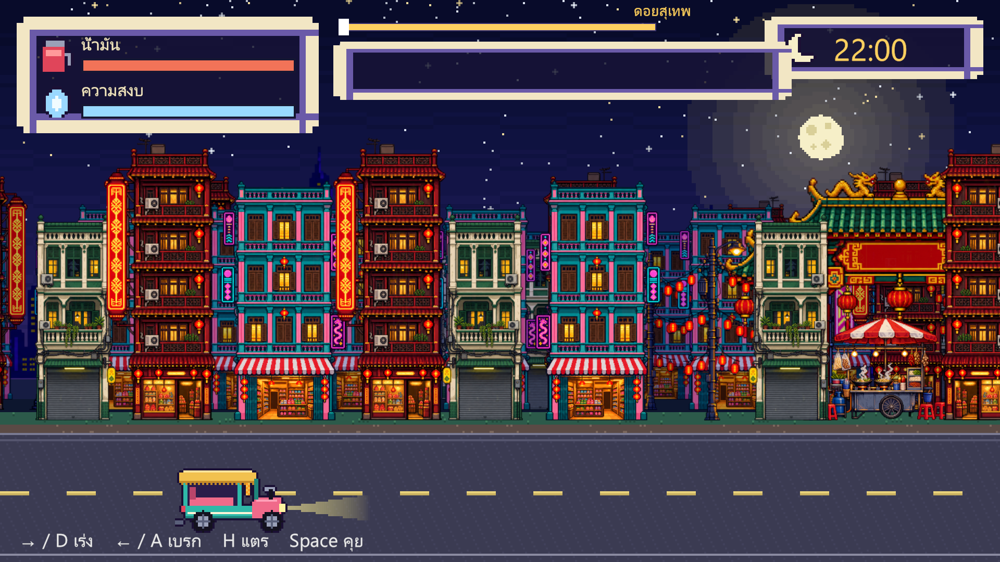 | 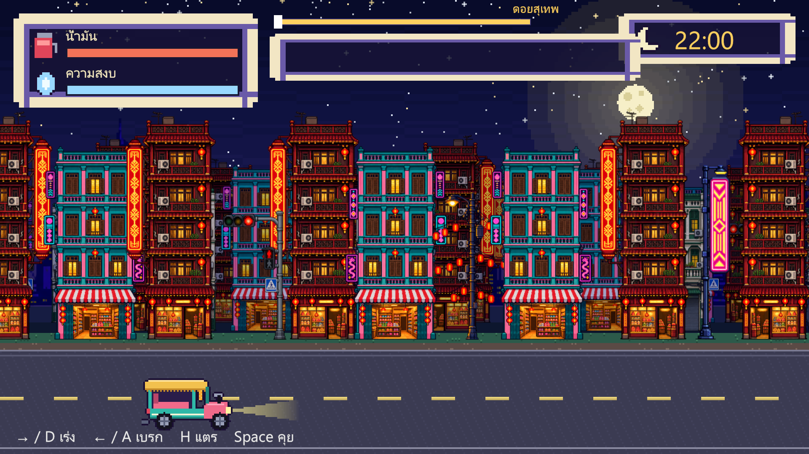 |
| **เยาวราช** — ตึกแถว ป้ายนีออน ไฟแดง ซุ้มประตูจีน | **เยาวราช** — รถเข็นอาหาร เสาโคม ตึกสูงไกล ๆ |
| 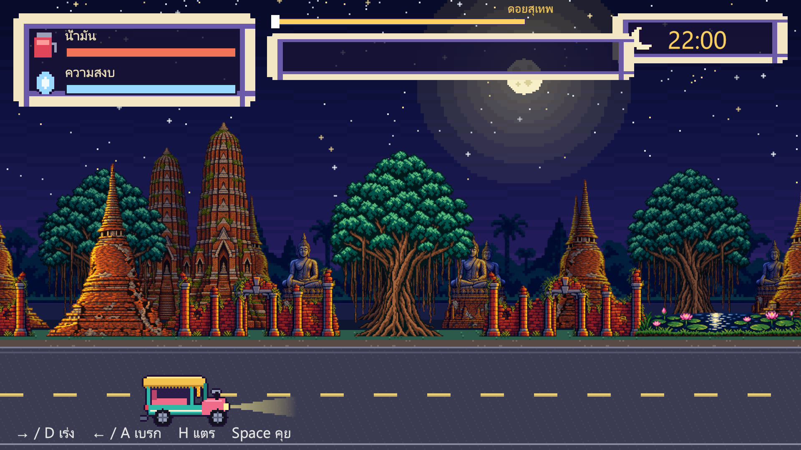 | 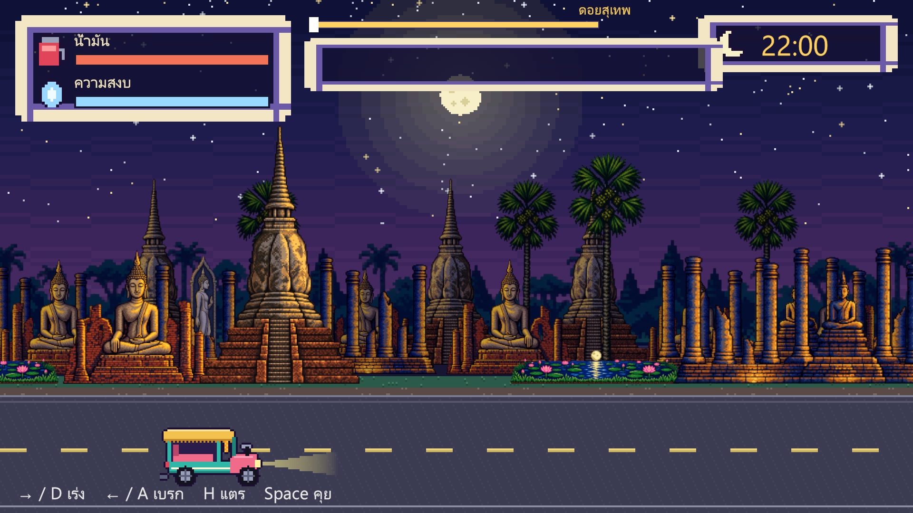 |
| **พระนครศรีอยุธยา** — ปรางค์อิฐ พระพุทธรูป ต้นไม้ใหญ่ สระบัว | **สุโขทัย** — เจดีย์ทรงพุ่มข้าวบิณฑ์ เสาวิหาร พระพุทธรูปลีลา ตาลโตนด |
| 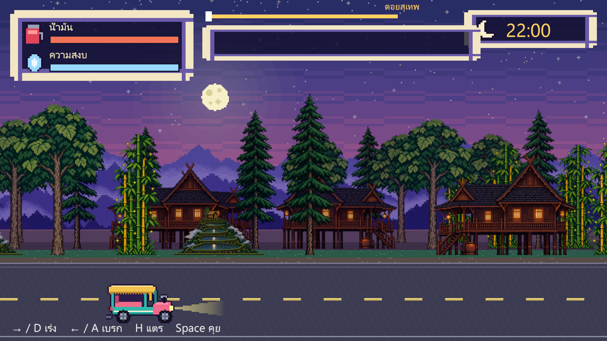 | 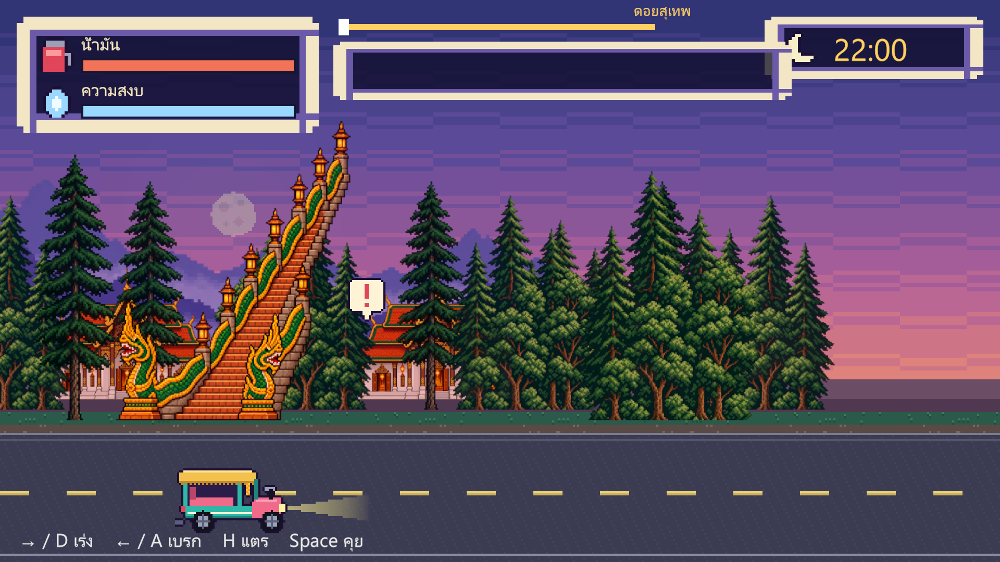 |
| **ถนนสู่ภาคเหนือ** — เรือนไม้ยกใต้ถุน สน ไผ่ ภูเขาหมอก | **ดอยสุเทพ** — บันไดพญานาค โคมหิน (จุดหมาย) |

> ภาพชุดนี้เรนเดอร์จากเกมในโหมดแก้ไข (ไม่ใช่การเล่น) ตัวเลขเวลา 22:00 บน HUD ค้างเพราะโหมดนี้ไม่ได้อัปเดต HUD

### วิธีทำให้เหมือนขับผ่านจริง

- **ชิ้นส่วน 39 ชิ้น** เจนด้วย Higgsfield (gpt_image_2_5) เป็น pixel art พื้นหลังโปร่งใส แยกตามสถานที่ ตัดขอบอัตโนมัติ (`ElementTrimmer`) ให้ฐานชิ้นแตะพื้นพอดี
- **4 ชั้นความลึก** (`SceneryField`): ชั้นหน้าเลื่อนเท่าถนน, ชั้นกลาง 2 ชั้นเลื่อนช้าลงและเล็กลงเป็นสีหม่น, ชั้นไกล (ตึกระฟ้า แนวต้นไม้ ภูเขา) เลื่อนช้าที่สุด มีแถบพื้นดินสีเข้มรองรับชั้นไกล
- **ความแน่นต่อสถานที่** — เยาวราชเรียงชิดเป็นแนวตึกต่อเนื่องไม่มีช่องว่าง (ชิ้นซ้อนกันเล็กน้อย) ส่วนอยุธยา สุโขทัย ภาคเหนือ ปล่อยช่องโล่งน้อยมากเป็นครั้งคราว ปรับได้ที่ `DensityOf` ใน `SceneryField`
- **วางตามสถานที่** — ชุดชิ้นส่วนของแต่ละที่อยู่ใน `ElementCatalog` สุ่มโดยไม่ซ้ำชิ้นเดิมติดกัน เว้นที่ให้จุดอีเวนต์ (รถเข็นป้าศรี ศาลพระภูมิ ฯลฯ) และมี landmark ครั้งเดียว (ซุ้มประตูเยาวราช ที่ต้นทาง บันไดพญานาคและเจดีย์ที่ดอยสุเทพ)
- **ท้องฟ้าและเวลา** — ท้องฟ้าดาว พระจันทร์ และสีรุ่งเช้ายังเป็นของเดิม ชิ้นส่วนทุกชิ้นค่อย ๆ อมสีอุ่นเมื่อใกล้ฟ้าสาง
- **ป้ายชื่อสถานที่** ขึ้นกลางจอเมื่อเข้าเขตใหม่
- **ของประกอบฉากของอีเวนต์** ใช้ชิ้นส่วนแบบเดียวกัน (รถเข็นอาหาร ศาลพระภูมิ ต้นไม้พระพุทธรูปอยุธยา ปั๊ม ร้านชำ) และบทพูดตรงกับเส้นทาง
- เก็บภาพฉากหลังใหญ่รุ่นแรก (5 สถานที่ × กลางคืน/รุ่งเช้า) ไว้ใน [Docs/RegionBackdrops/](RegionBackdrops/) เป็นภาพคอนเซ็ปต์ ไม่ได้ใช้ในเกมแล้ว

### บั๊กที่แก้: ฉากหลังเพี้ยนเป็นแถบไล่สี

ผู้เล่นรายงานว่าฉากหลัง ถนน พระจันทร์ และไฟหน้ารถกลายเป็นแถบสีม่วงไล่ระดับ มีแต่ตัวตุ๊กตุ๊กกับ UI ที่ปกติ ทุก sprite ที่ไม่ถูกกำหนด sprite ซ้ำทุกเฟรมดูเหมือนใช้ texture ท้องฟ้าร่วมกัน (ผมสร้าง Material เดียวแล้วแชร์ให้ SpriteRenderer หลายร้อยตัว) จึงเปลี่ยนให้ **แต่ละ texture มี Material ของตัวเอง** (`SpriteMats`) แต่ผมเรนเดอร์ฉากแบบเดิมในเครื่องผมไม่เพี้ยนเลย ยืนยันสาเหตุจริงไม่ได้ ต้องให้เล่นจริงเพื่อดูว่าหายไหม

### ข้อจำกัด / ที่ยังไม่ได้ตรวจ

- ยังไม่ได้รันเกมเต็มเที่ยวด้วยฉากใหม่ (สคริปต์ทดสอบแบบเล่นอัตโนมัติค้างใน Unity ของผม) ภาพข้างบนมาจากการเรนเดอร์ในโหมดแก้ไข
- ไฟแดงเป็นของประกอบฉากอย่างเดียว ยังไม่ได้ทำให้รถต้องหยุดรอ (ทำต่อได้)
- เวลาและระยะทางไม่สมจริง (กรุงเทพ→เชียงใหม่ในคืนเดียวด้วยตุ๊กตุ๊ก) ตั้งใจให้เป็นเรื่องเหนือธรรมชาติ ซึ่งบทเปิดบอกไว้แล้ว
- ชิ้นส่วนเป็นภาพ AI ไม่ใช่งานวาดตามแบบจริง ควรตรวจความถูกต้องของสถาปัตยกรรมก่อนส่งงาน (ภาพไม่มีตัวอักษรอ่านออก) พื้นที่ภาพ AI ในโปรเจกต์ประมาณ 36 MB ก่อนบีบอัด
- ต้องกดเมนู **Tools → Last Ride → Build Scene** หนึ่งครั้ง เพื่อให้ตัดขอบชิ้นส่วนและสร้าง sprite ใหม่ครบ

## วิธีรัน

1. เปิดโปรเจกต์ด้วย Unity 6000.3.12f1
2. เมนู **Tools → Last Ride → Build Scene** (ครั้งแรกจะนำเข้า TextMesh Pro ให้ก่อน ถ้าไม่ต่อให้กดซ้ำอีกครั้ง)
3. กด Play

ปุ่ม: `→/D` เร่ง · `←/A` เบรก · `H` แตร · `Space` คุย/ยืนยัน · `↑/↓` เลือกตัวเลือก · `R` เล่นใหม่เมื่อจบ

---

## Devlog #3 — ความหนาแน่นฉาก, มอเตอร์ไซค์, ไฟจราจร, แดชบอร์ดตุ๊กตุ๊ก

- **ฉากแน่นขึ้น**: ลดช่องว่างระหว่างตึก/องค์ประกอบ (Yaowarat เป็นแนวตึกต่อเนื่อง) ใน `SceneryField.DensityOf`
- **มอเตอร์ไซค์ขับผ่าน** (`TrafficDirector.SpawnBike`): วิ่งสวน 55% / แซงตุ๊กตุ๊ก 45% เป็นประกอบฉาก (ไม่ชน)
- **ระบบไฟจราจร** (`TrafficSignal`): เขียว 16 / เหลือง 2.5 / แดง 9 วินาที รถคันหน้าหยุดที่เส้นขาว ผู้เล่นต้องต่อแถว ฝ่าไฟแดง = ความสงบ −5
- **แดชบอร์ดตุ๊กตุ๊กด้านล่างจอ**: ซ้าย น้ำมัน/ความสงบ, กลาง จอ LCD สีเขียว (สถานที่, ผู้โดยสาร, บุญ), ขวา นาฬิกา + แถบความเร็ว, ล่างสุด แถบเส้นทางเยาวราช→ดอยสุเทพ พร้อมชื่อสถานที่ กล้องถูกยกขึ้น (`RideGameConst.DashUnits`) ให้ถนนอยู่เหนือแดชบอร์ด
- ภาพ: `Docs/Screenshots/dashboard_*.png`, `scenery_bikes_passing.png`

### อัปเดตต่อจาก Devlog #3

- **ตำรวจเรียก**: ฝ่าไฟแดง → ตัดเข้าฉากตำรวจ (`Story.Police`) เลือกตอบได้ 3 แบบ เสียเวลา 6/10/14 วินาที, ความสงบ/บุญลดตามคำตอบ
- **แก้รถคันหน้าค้างที่ไฟแดง**: รถคันหน้าออกตัวทันทีเมื่อไฟเขียว, ไม่จอดนิ่งเกิน 2.5 วินาทีโดยไม่มีเหตุ, ไฟแดงสั้นลงเป็น 7 วินาที (ยังไม่ยืนยันสาเหตุเดิมในเกมจริง)
- **ชิดซ้ายแบบไทย**: เลนเราอยู่เลนบน, รถสวน/มอเตอร์ไซค์อยู่เลนล่างและวาดทับหน้า (`NearLaneY=-5.5625`, `FarLaneY=-7.5625`)
- **ตุ๊กตุ๊กใหม่ตาม mood board #1**: หลังคากรมท่า, ตัวถังน้ำเงินแถบทอง, จมูกเหลือง, คนขับ, ธง, พวงมาลัย (ยังเป็นสองล้อ ไม่ใช่ล้อหน้าเดียว)
